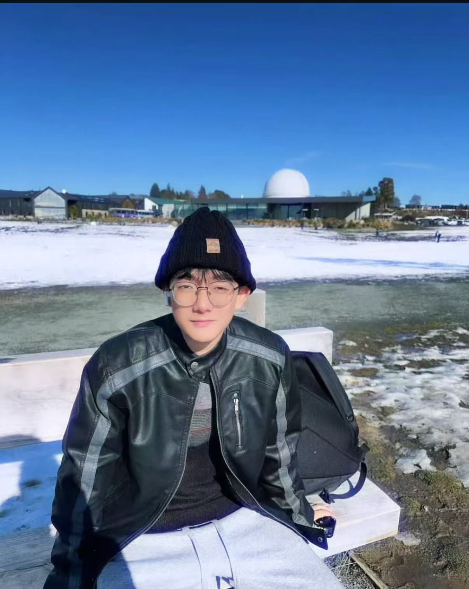
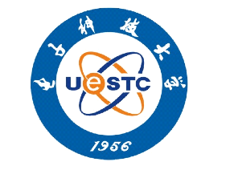

# 👋 Hi, I’m 潘宇琦

Welcome to my personal website!

I’m a rising senior majoring in Software Engineering, with a focus on **frontend development**.  
My main tech stack includes **Vue**, **React**, and other modern frontend tools such as **TypeScript**, **Node.js**, and **Vite**.

I’m also deeply interested in the field of **product management**, and currently learning product thinking, user-centered design, and prototyping using tools like **Figma**.  
I enjoy exploring how technology and design come together to solve real-world problems, and I'm continuously growing through hands-on projects.
And here's a photo of me when I was travelling in New Zealand.

## 💼 About Me

- 🎓 Currently studying Software Engineering at  **UESTC**, now entering my senior year.
- 🧠 Passionate about **Product Thinking** & **Front End Engineering**
- 💻 Experienced with:
  - `Vue` · `React` · `TypeScript` · `Element Plus` · `Figma`
- 📚 Currently exploring:
  - **Product Strategy** · **Growth Loops** · **AI-powered Prototyping**
- 🌟 Personality:
  - MBTI: **ENFJ** · Zodiac: **Cancer**
- 🎵 Outside of tech, music is my biggest passion — I'm a **10000% Swiftie** 💖
- 🌍 Based in **Chengdu, China**

### 🧩 Fun Facts

- 🍜 **My Favorite Food**: Spicy hotpot! There's nothing better than a bubbling pot shared with friends on a rainy day.
- 🎭 **Hidden Skill**: I can recognize and name almost any Taylor Swift song within the first few seconds — yes, even the vault tracks.
- 😳 **Most Embarrassing Moment**: Once, I confidently walked into the wrong classroom, sat through 10 minutes of a completely different major’s lecture before realizing... then pretended I was “just visiting a friend.”
- 🐾 **A Little Flaw**: I tend to overthink things — from UI pixel spacing to what someone really meant in a text.
- 📝 **To My 2026 Self**:  
 *"I hope you’ve already achieved your goals — and that you’re doing work you love and find meaningful."*

## 📫 Contact Me

- **Email**: `haechanLee06_@outlook.com`
- **GitHub**: [haechanLee06](https://github.com/haechanLee06)

---

Thanks for visiting 🙌
